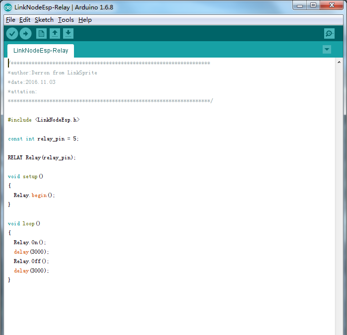
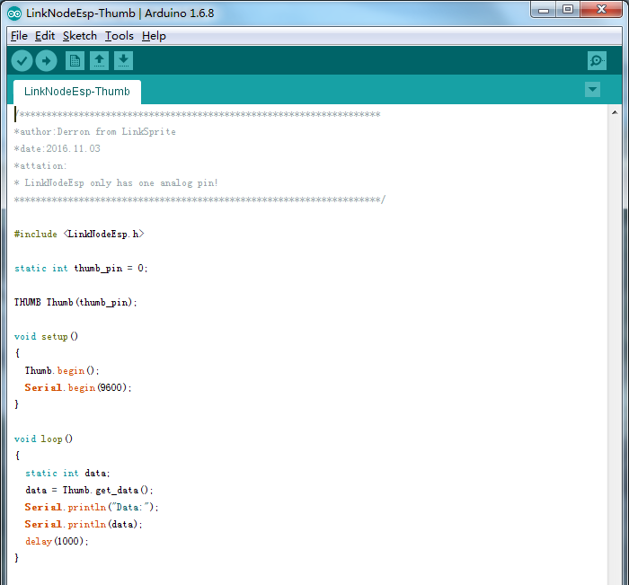

# LinkNode core Esp8266 

## Introduction 

LinkNode core is Arduino-compatible WiFi development board which is powered by the high integrated WiFi chip ESP-8266EX.

Thanks for the contribution from open source community who have developed Arduino core for ESP8266, this let Aduino IDE program LinkNode core without any change. At the same time, LinkNode core Esp8266 has Linker Base which make it very easy to connect to LinkNode Sensors.

## Features
* Powered by ESP-8266EX
* 8 Digital I/O pins
* 1 Analog Input pin
* 1 micro USB port for power/configure
* Compatible with [Arduino programming](https://github.com/pcduino/LinkNodeD1)
* Compatible with [NodeMCU](http://www.nodemcu.com/index_cn.html)
* OTA -- Wireless Upload(Program)

## Pin Mapping

| Arduino Pins | ESP8266 Pins |
| -------------|:------------:|
| D0    | GPIO10    |
| D1    | GPIO15    |
| D2    | GPIO2     |
| D3    | GPIO0     |
| D4    | GPIO13    |
| D5    | GPIO12    |
| D6    | GPIO14    |
| D7    | GPIO16    |

## Tutorials

### 1.Get started on Arduino
The tutorial of LinkNode core Esp8266 to get started on Arduino programing as same as [LinkNode D1](http://linksprite.com/wiki/index.php5?title=LinkNode_D1).

### 2.LinkNode core Esp8266 Sensors
LinkNode core Esp8266 have many sensors now and sensor-driven are already written, we also continue to update the number of sensors,we will make LinkNode series more stronger.
* Download LinkNode core Sensors library from [github](https://github.com/delongqilinksprite/LinkNodeEsp/tree/master/LinkNodeEsp).
* Move the library to arduino-xxx(version)/libraries/

#### a.LinkNode Module Buzzer

Open the code LinkNodeEsp-Beep

Upload the code and then you can test the buzzer module.

#### b.LinkNode Module Relay

Open the code LinkNodeEsp-Relay

Upload the code and then you can test the Relay module.

#### c.LinkNode Module Infraed Emitter

Open the code LinkNodeEsp-IRsend

Upload the code and then you can test the IR module,you should have a IR Recieve Module or some IR equipments.

#### d.LinkNode Module Thumb Joystick

Open the code LinkNodeEsp-Thumb

Upload the code and then you can test the Thumb Joystick module,LinkNode core Esp8266 only have one anglog pin.

#### e.LinkNode Module Tem&RH Sensor-AM2302

Open the code LinkNodeEsp-Am2302

Upload the code and then you can test the AM2302 module,wo can use this module get Humidity,Temperature.

#### f.LinkNode Module Pressure Sensor

Open the code LinkNodeEsp-Bmp280

Upload the code and then you can test the Bmp280 module,wo can use this module get Pressure,Temperature.

#### g.LinkNode Module Light Sensor

Open the code LinkNodeEsp-Temt6000

Upload the code and then you can test the Temt6000 module.

#### h.LinkNode Module 4Dig-7Seg

Open the code LinkNodeEsp-Seg

Upload the code and then you can test the 4Dig-7Seg module.
